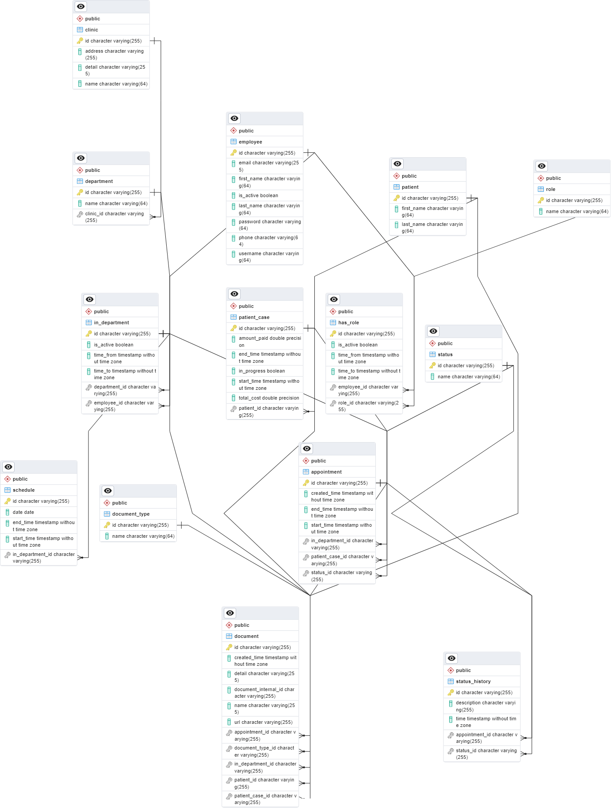

# Clinic Management System

## Description

This is a clinic management system that allows users to manage their patients and appointments. Simple CRUD operations
are performed on the patients and appointments. Generate patient reports and appointment reports PDF files.

## Getting Started

### Prerequisites

* Java 17
* Maven
* PostgreSQL

### Installing

* Clone the repository
* Open the project in your favorite IDE
* Run `mvn clean install` to build the project
* Create a database named `ClinicManagementSystem` in Postgres

## Entity Classes

### Role

- id
- role_name String(64)
- List<HasRole> has_roles (One to Many)

### hasRole

- id
- time_from LocalDateTime
- time_to LocalDateTime
- is_active Boolean
- Role role(Many to One)
- Employee employee (Many to One)

### Employee

- id
- first_name String(64)
- last_name String(64)
- username String(64)
- password String(64)
- email String(255)
- phone String(64)
- is_active Boolean
- List<HasRole> has_roles (One to Many)
- List<InDepartment> in_departments (One to Many)

### InDepartment

- id
- time_from LocalDateTime
- time_to LocalDateTime
- is_active Boolean
- Department department (Many to One)
- Employee employee (Many to One)
- List<Schedule> schedules (One to Many)
- List<Appointment> appointments (One to Many)
- List<Document> documents (One to Many)

### Schedule

- id
- date LocalDate
- time_start LocalDateTime
- time_end LocalDateTime
- InDepartment in_department (Many to One)

### Department

- id
- name String(64)
- Clinic clinic (Many to One)

### Clinic

- id
- name String(64)
- address String(255)
- details String(255)
- List<Department> departments (One to Many)

### Patient

- id
- first_name String(64)
- last_name String(64)
- List<PatientCase> patient_cases (One to Many)
- List<Document> documents (One to Many)

### PatientCase

- id
- start_time LocalDateTime
- end_time LocalDateTime
- in_progress Boolean
- total_cost BigDecimal
- amount_paid BigDecimal
- Patient patient (Many to One)
- List<Appointment> appointments (One to Many)
- List<Document> documents (One to Many)

### Appointment

- id
- created_time LocalDateTime
- start_time LocalDateTime
- end_time LocalDateTime
- Status status (Many to One)
- List<StatusHistory> status_histories (One to Many)

### Status

- id
- name String(64)
- List<Appointment> appointments (One to Many)
- List<StatusHistory> status_histories (One to Many)

### StatusHistory

- id
- time LocalDateTime
- details String(255)
- Status status (Many to One)
- Appointment appointment (Many to One)

### DocumentType

- id
- name String(64)
- List<Document> documents (One to Many)

### Document

- id
- document_internal_id String(64)
- name String(255)
- created_time LocalDateTime
- url String(255)
- details
- DocumentType document_type (Many to One)
- Patient patient (Many to One)
- PatientCase patient_case (Many to One)
- Appointment appointment (Many to One)
- InDepartment in_department (Many to One)
